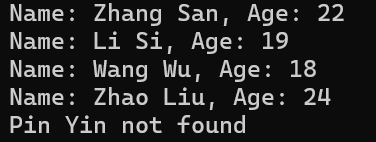

# 01-OOP-homework

## 1 运行方法

系统环境：Win11

平台：Visual Studio 2022

运行：

    1. 双击 Visual Studio 解决方案文件（.sln文件），打开项目
    2. x64 release 运行

## 2 运行结果

### 2.1 task1 member

part1

part2

* 查询不到时，使用 `name + not found` 表示

### 2.2 task2 shape

### 2.3 task3 max

