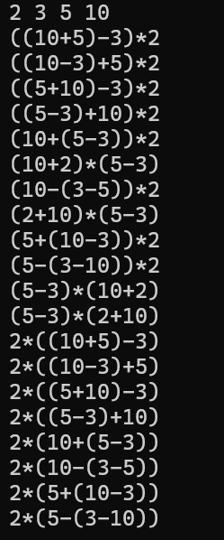
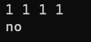
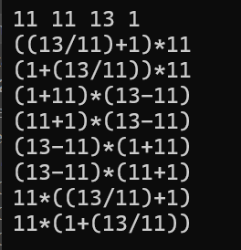
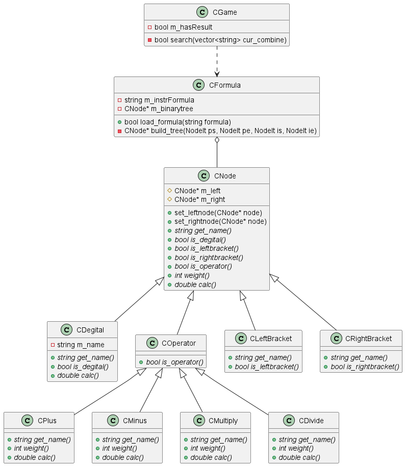

# 02-C++高质量编程-homework

## 1 运行方法

系统环境：Win11

平台：Visual Studio 2022

运行：

    1. 双击 Visual Studio 解决方案文件（.sln文件），打开项目
    2. x64 release 运行

## 2 运行结果

### 2.1 task1 24点

样例：2 3 5 10

无解：1 1 1 1

除法：11 11 13 1

## 3 算法

### 3.1 task1 24点

#### 算法思路

枚举所有表达式，分别计算各表达式的值，若为24则输出

#### 算法实现

**枚举方法：**

该功能在游戏类`CGame`中实现

从当前表达式数组中，
选取两个表达式进行组合（+-*/四种组合），
形成新的子表达式，
在新的子表达式两侧加上括号，
加入新表达式数组。

同时其余未在此轮进行组合的表达式也加入新表达式数组。

对新表达式数组进行递归搜索，
直至数组大小为1，
即得到相应卡牌组合的一个完整表达式。

**表达式计算方法：**

该功能由表达式类`CFormula`实现

1. 传入string类型的中序表达式
2. 由中序表达式获得前序表达式（双栈法）
3. 由前序与中序表达式恢复表达式树
4. 由表达式树计算得表达式值

#### 程序实现

24点程序设计类图（忽略部分成员变量与成员函数）

代码抽象封装完成度较好，具有很强的可扩展性。

可以通过添加`CNode`的子类增加自定义运算符，包含符号、权重等信息。
可以通过调整`CGame`的成员变量，以实现改变卡牌数量、目标数字等操作。
