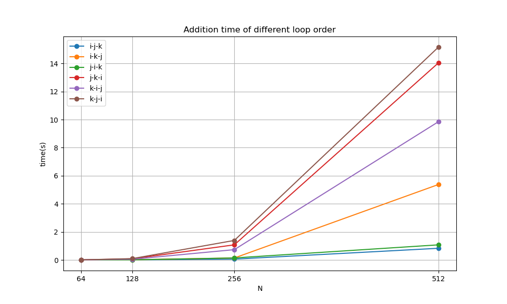

# 03-程序优化-homework

## 1 运行方法

系统环境：Win11

平台：Visual Studio 2022

运行：

    1. 双击 Visual Studio 解决方案文件（.sln文件），打开项目
    2. x64 release 运行

## 2 运行结果

测试了在不同规模下，不同方式的循环体运行100次的平均时间

结果如下：
```
N=64
TEST_TIMES=100
i-j-k=0.000768065
i-k-j=0.00124447
j-i-k=0.00100012
j-k-i=0.00464515
k-i-j=0.00526695
k-j-i=0.00510975
N=128
TEST_TIMES=100
i-j-k=0.0103729
i-k-j=0.0127228
j-i-k=0.0082717
j-k-i=0.0812171
k-i-j=0.0510739
k-j-i=0.093686
N=256
TEST_TIMES=100
i-j-k=0.0582007
i-k-j=0.137839
j-i-k=0.14202
j-k-i=1.07544
k-i-j=0.732741
k-j-i=1.38959
N=512
TEST_TIMES=100
i-j-k=0.829495
i-k-j=5.37447
j-i-k=1.07414
j-k-i=14.0406
k-i-j=9.84825
k-j-i=15.1626
```

画出 $N-time$ 图像



## 3 结果分析

### 数据分析

从数据与图像中可以看出：

1. `i-j-k` 与 `j-i-k` 这两个循环顺序在各规模下都耗费相对较短的运行时间

2. `k-j-i` 与 `j-k-i` 这两个循环顺序在各规模下都耗费相对较长的运行时间，且规模越大，与耗费较短时间的循环顺序的耗时差距越大

3. `i-k-j` 与 `k-i-j` 这两个循环顺序在规模较小时耗时相对也较少，但是随着规模增加，耗时相对也不断增加，与耗时相对较少的循环顺序的差距逐渐增大

4. 在数组规模上，规模较小时各循环顺序相差不大，而随着规模增大，差距逐渐增大

### 原因分析

从**内存的cache机制**分析：

计算机访问内存时，会先访问硬件中的缓存，
**缓存容量小但读取速度快**。

缓存中会保存着近期使用过的数据。
如果缓存中有要访问的内容，则**缓存命中**，直接读取缓存。
如果缓存中没有要访问的内容，则**缓存未命中**，需要从内存中读取该内容。

缓存未命中时，从内存中读取的内容会被写入缓存。如果缓存容量已满，则会将长期未使用的内容移出缓存。

将内存中的内容读入缓存时，会将附近的一块数据都进行读入。

多维数组在内存中以一维数组的形式储存，在此程序中体现为以 `k` 代表的维度是连续的，其次是 `j`， 最后是 `i`。

`i-j-k` 与 `j-i-k` 这两个循环顺序在多数情况下运行速度更快。
原因是这些顺序使得访问数组元素时，访问的是相邻的内存地址，
内存访问更连续。
从而提高了缓存命中率，程序速度更快。

`k-j-i` 与 `j-k-i` 这两个循环顺序在多数情况下较慢。
原因是按照这些顺序访问数组元素，元素对应的内存地址是离散的。
从而导致了更多的缓存未命中，降低了运行速度。

随着数组规模的增大，`j` 与 `i` 维度上相邻的元素在内存地址中距离越远，
缓存逐渐无法存下该维度的所有元素，从而缓存未命中概率大大增加，
降低了运行速度。

### 总结

在实际代码编写中，需要注意尽量访问连续的，或者相近的内存内容。
读取某一内容后，尽量多使用它与它附近的内容。
