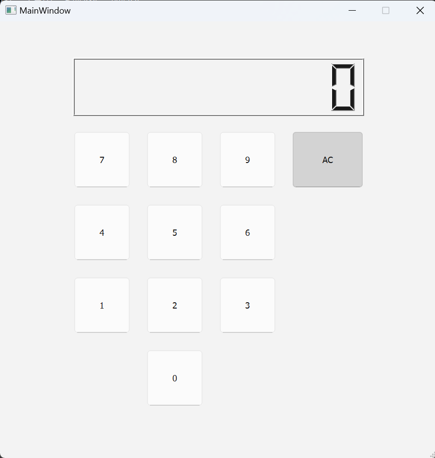
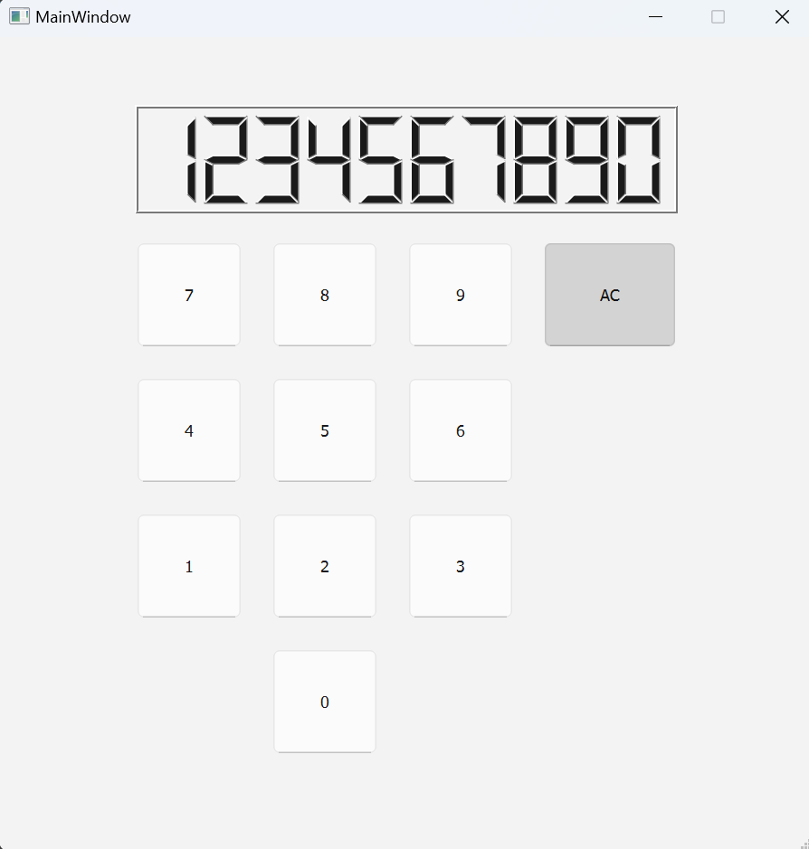
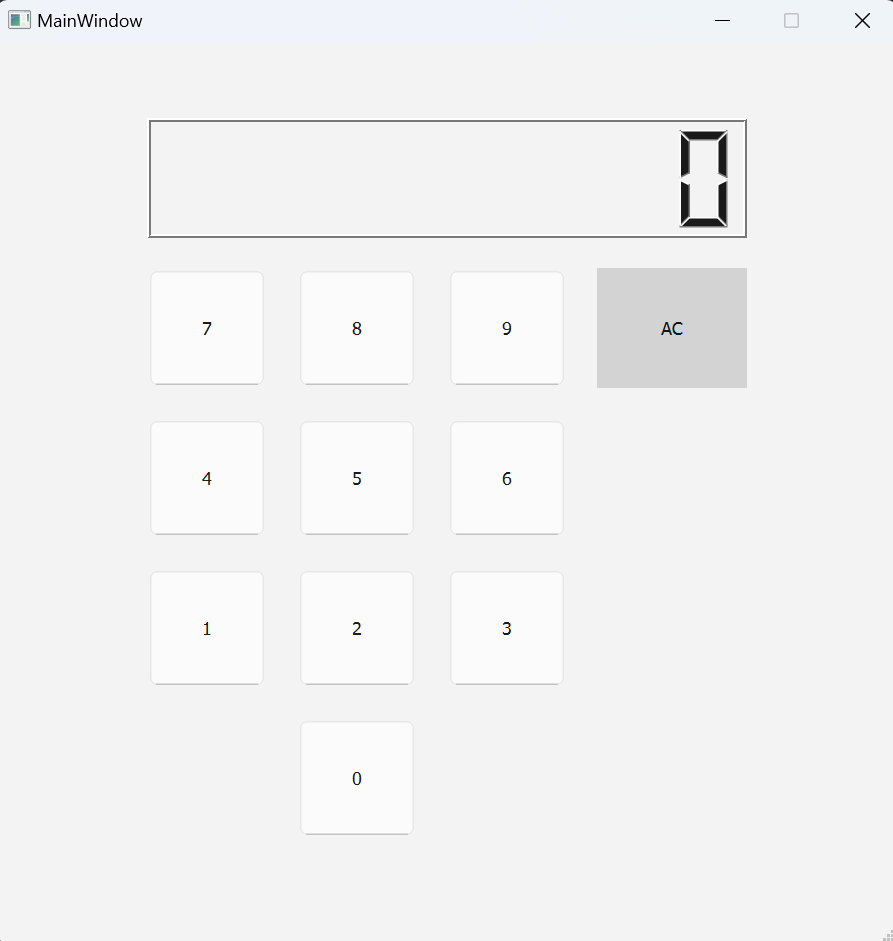
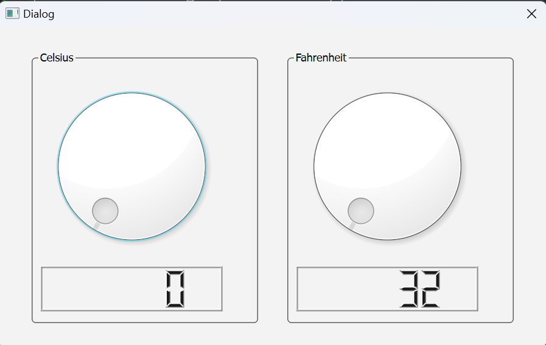
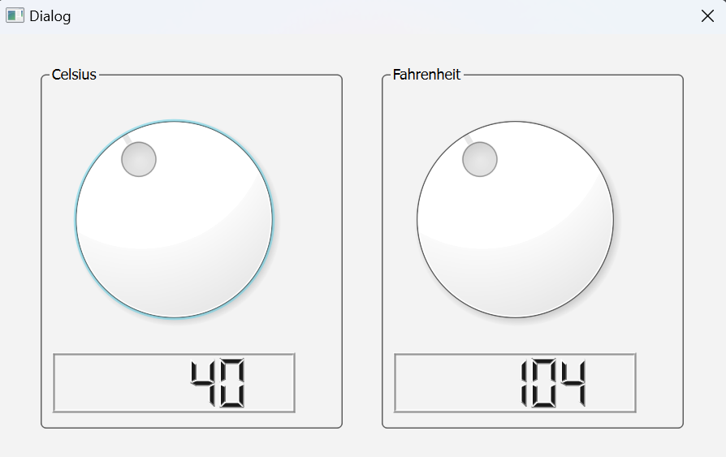
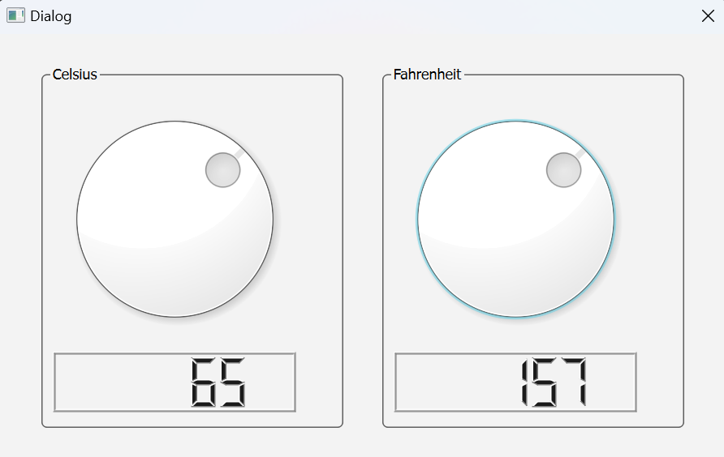

# 04-qt1-homework

## 1 运行方法

开发环境与平台：

    Win11
    Qt Creator 13.0.2
    Qt 6.8.0

运行：

    1. 在 Qt Creator 中选择 CMakeLists 打开项目
    2. 选择 Qt 6.8.0 MinGW 64-bit 或其他构建套件进行配置
    3. 点击编译运行

## 2 运行结果

### 2.1 数字键盘

界面

显示按下的数字序列，最多能输入10位

清除控件中的数字，AC键（All Clean）

### 2.2 温度转换器

初始界面

可以通过摄氏度轮盘调节

也可以通过华氏度轮盘调节

