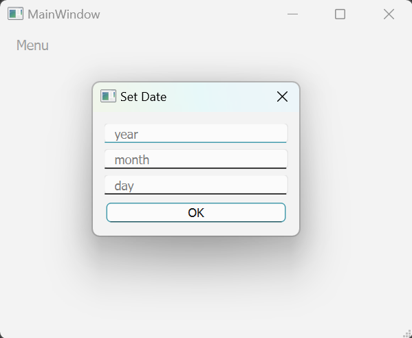
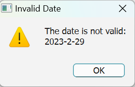

# 05-qt2-homework

## 1 运行方法

开发环境与平台：

    Win11
    Qt Creator 13.0.2
    Qt 6.8.0

运行：

    1. 在 Qt Creator 中选择 CMakeLists 打开项目
    2. 选择 Qt 6.8.0 MinGW 64-bit 或其他构建套件进行配置
    3. 点击编译运行

## 2 运行结果

### 2.1 文字编辑

初始界面，提示在上方的文本框输入文字，
下方的文本框设为了只读

输入文字

按下回车，下方文本框新增一行文字，上方清空

可以添加多行文字

### 2.2 日期

在主界面的菜单栏中，选择 `set date`

弹出窗口，提示输入年、月、日

**检测输入日期合法性**

在自定义类 `Date`中，检测日期合法性

程序获得代表年、月、日的三个 `QString` 类型数据

首先判断是否为整数

再判断年月日是否在应有范围内

最后根据年、月，判断日期是否合法，包括各月天数、闰年等判断

年/月/日超出应有范围，不合法

闰年的2月有29日

平年的2月没有29日

输入非整数，不合法

### 2.3 图片按钮

点击按钮即可切换图片。

共4张图片，循环播放。

